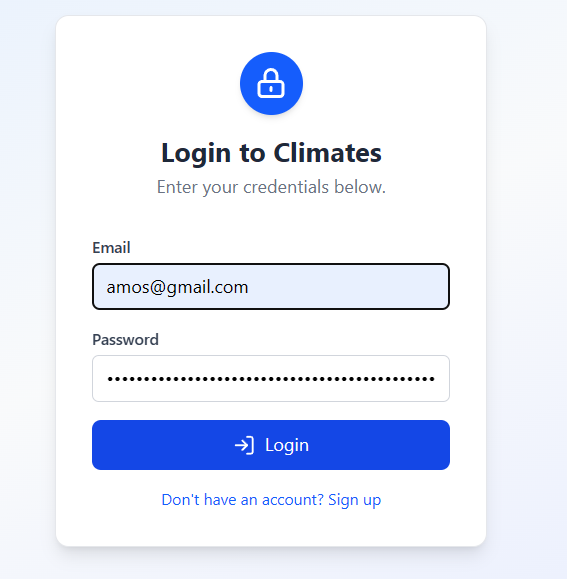
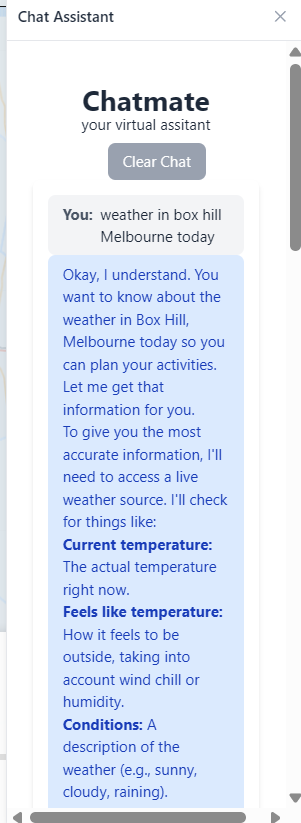
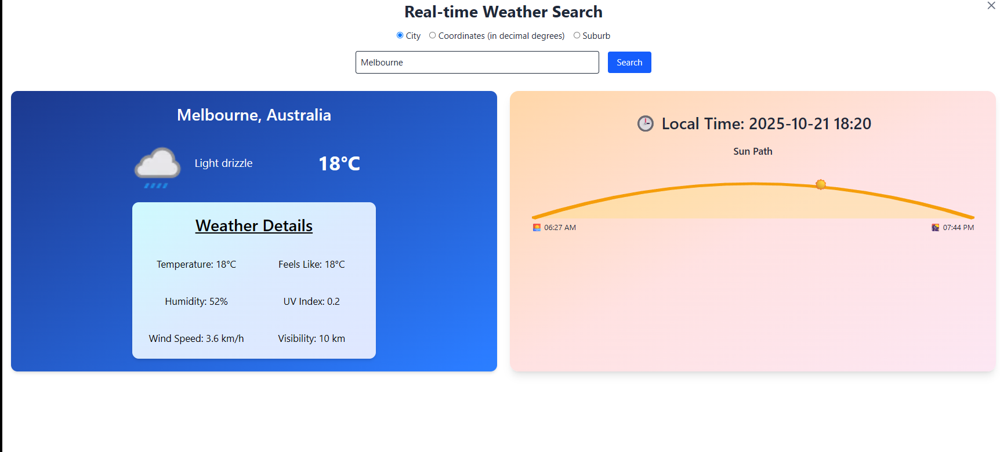
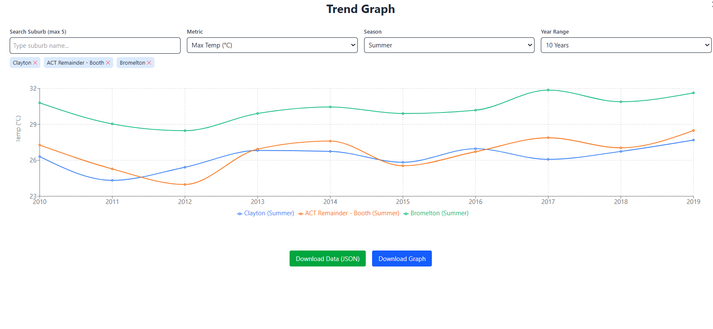
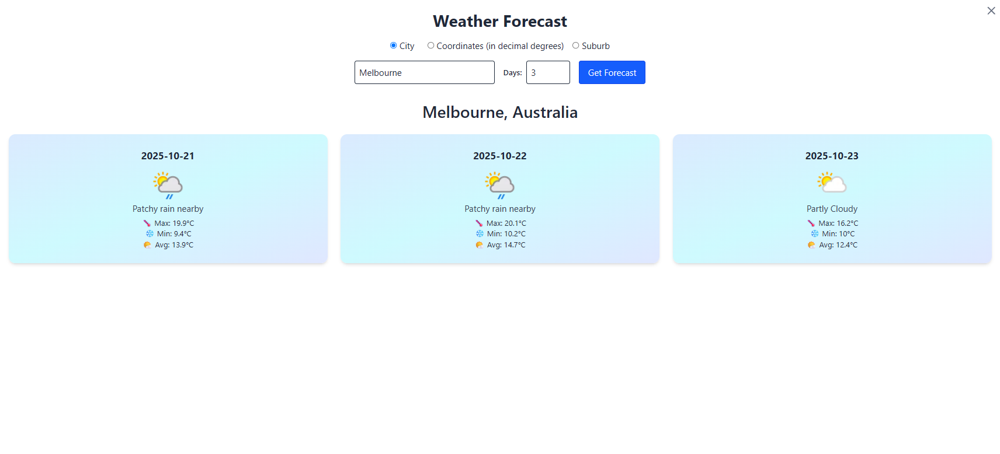

# 🌦️ Climate Visualization Dashboard (2025 Data Science Project – Group DS07)

A full-stack web application that visualizes and analyzes climate data across Australia.  
Developed as part of the **2025 Data Science Project (Group DS07)** at Monash University, Australia.

---

## 🔐 Features

- **User Authentication:** Secure login and sign-up functionality.  
- **AI Chat Assistant:** An integrated chatbot that helps users query weather information naturally.  
- **Real-time Weather Display:** Fetches and visualizes live weather data for selected cities or suburbs.  
- **Trend Graph Comparison:** Compares long-term climate trends (e.g., temperature, precipitation) across multiple locations.  

---

## 🖼️ Screenshots

| Login Page | AI Chat Assistant | Real-time Weather | Trend Graph | Forecast |
|-------------|------------------|------------------|--------------|-----------|
|  |  |  |  |  |

---

## 🛠️ Tech Stack

- **Frontend:** React + TypeScript + Tailwind CSS  
- **Backend:** Node.js + Express  
- **Database:** MongoDB  
- **APIs:** WeatherAPI / OpenWeather for live data fetching  

---

## 🚀 Getting Started

1. Clone the repository  
   ```bash
   git clone https://github.com/yourusername/2025_DataScienceProject_DS07.git

2. Install dependencies
   ```bash
   npm install

3. Start the development server
   ```bash
   npm run dev
   
4. Access the app at
   ```bash
   http://localhost:5173

## 👥 Authors

**Group DS07 – Monash University, Australia**

- Tang Jia Shen
- Gunin Khanna
- Koh Zen Yii
- PeiZhen Jiang
- John Elisa
